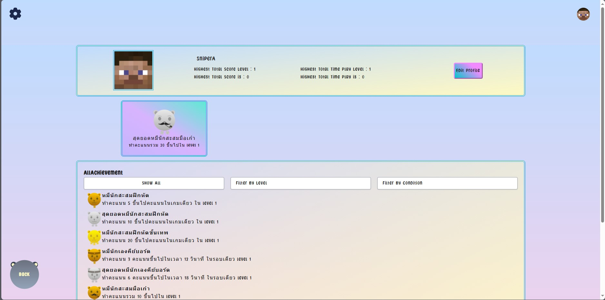

## PROJECT2-SEC-1-SUPERIDOL
## สมาชิก 
**[jirananyenlab](https://www.github.com/jirananyenlab)  65130500010 จิรนันท์ เย็นลับ (20%)**

- Achievement
- cardBase,bearButton  component 
- listequation,Modal,achievementPopUp component 
  

**[Jhatniphat](https://github.com/Jhatniphat)  65130500012 นายเจตนิพัทธ์ สารกาล (20%)**

- profilePage
- router Guard
- html,CSS, db.json

**[FocusXis](https://www.github.com/FocusXis)  65130500042 ปรมะ จิราศุภดิลก (20%)**

- LeaderBoard(Competitive),Credit
- navBar component
- updateSetting Music,SFX

**[GodeFvt](https://www.github.com/GodeFvt)  65130500054 พุทธินันท์ ภาคแสวง (20%)**

- Store
- Router
- AuthenticationForm,toast,endGame component
- fetchApi(Update)

**[Pumrapee](https://www.github.com/Pumrapee)  65130500063 ภูมิระพี ไชยสา (20%)**

- fetchApi(CR_D)
- Tutorial,Ingame
- equationBox , achievementPopUp component

## Tasklist
- [x] base template
- [x] แยก component
- [x] ทำ routing
- [x] หน้าสอนเล่น (tutorial)
- [x] ระบบล็อกอิน ( CRUD )
- [x] leaderboard ( CRU )
- [x] เลเวลมีที่สิ้นสุด
- [ ] ปุ่มหยุด ( optional )
- [x] จบเกมบอกอย่างอื่นด้วย นอกจากคะแนน
- [ ] special เพิ่ม Ex. ไอเทมฟรีซ
- [x] แยกโหมดฝึกฝน(จบได้) , โหมดแข่งขัน (วัดกันที่คะแนน) , โหมด Custom (เลือกได้ว่าจบหรือไม่จบ)
- [x] Achievement ( CRU )
- [x] แจ้งเตือนสำเร็จ Achievement
- [x] หน้าโปรไฟล์ ( R )

## Feature
1. หน้าหลักมีโหมดให้เลือกหลากหลายมากขึ้นโดยจะมี campaign,competitive,tutorial,custom,credit
2. ระบบAuthentication,Register
3. หน้า profile แสดงข้อมูลต่างๆของ user เช่น username หรือ achievement
4. ระบบAchievement ที่จะเก็บไว้ใน db.json ของแต่ละ user
5. หน้าLeaderBoard ที่จะเอา HighScore ที่ทำใน competitive มาlistให้เห็น
6. ตอนจบเกมสามารถดูสมการเก่าๆที่ทำไว้ในตานั้นได้ แสดงจำนวนสมการที่ทำถูกและผิดทั้งหมด
7. ยืนยันการลบและpop-up แจ้งเตือนเวลาเข้าแบบเป็น guest
8. ปรับลดเสียงmusicและเสียงeffect ได้โดยสามารถเก็บไว้เป็น setting ของuserนั้นๆ

## Application Manual
1. เมื่อเริ่มเกมจะมีสมการสุ่มตกลงมา หากพิมพ์คำตอบถูกต้อง จะได้รับ 1 คะแนนแต่ถ้าผิด จะเสียเลือด 1 Hp โดยเลือดจะถูกกำหนดต่างกันไปในแต่ละด่าน
   ตัวสมการจะมีตัวSpecial score,health ที่จะเกิดขึ้นก็ต่อเมื่อสมการนั้นมีความยาวสูงสุดของด่านโดยSpecial-Scoreถ้าตอบถูกจะได้ 2 คะแนน Special-Healthถ้าตอบถูกจะได้รับ HP+1และ 1คะแนน ถ้าหากว่าพิมพ์คำตอบไม่ทันก่อนที่สมการจะตกถึงพื้นจะ -1HP ถ้า HP หมดจะถือว่า GameOver
     
3. มีโหมดเล่นให้เลือกหลักๆ 3 โหมด Campaign,Custom,Competitive
   Campaign จะต้องทำคะแนนให้ถึงตามที่กำหนดไว้ถึงจะถือว่าจบเกม
   Custom เป็นโหมดที่สามารถ จัดแต่งlevel ของด่านด้วยตัวเองปรับความยาวสมการ,rangeของตัวเลขที่จะสุ่มขึ้นมา,ความเร็ว หรือแม้กระทั่งสัญลักษณ์ + - * / เป็นต้น
   Competitive โหมดแข่งขัน คะแนนที่ทำในนี้จะถูกบันทึกลงและไปแสดงในหน้า leaderBoard 100 อันดับแรก เป็นโหมดที่ไม่มีวันจบจนกว่าจะGameOver
     
5. Achievement สามารถได้รับจากการเล่น Campaign ซึ่งจะมีวิธีได้ต่างกันไปแต่ละAchievement เช่นผ่านด่าน level 1, ทำคะแนน 6 คะแนนขึ้นไปในเวลา 18 วินาที เป็นต้น
    
   
## Present Video
[Click Here](https://www.youtube.com/watch?v=HZgh0FXLfZA) For Video
